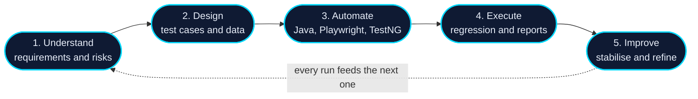

<div align="center">


[](https://github.com/ABHAY-0312)

</div>

<br/>

| At a glance | |
|:--|:--|
| **Role** | Quality Engineering Intern at Deloitte |
| **Automation** | Java, Playwright, TestNG |
| **Testing** | Functional, regression, UI, web application and database testing |
| **Recognition** | State level selection, *Building with OpenAI* (NxtWave) |
| **Builds** | AI-powered and technology-driven projects |

<br/>

## About

I'm a Quality Engineering Intern at Deloitte. My days are spent on software testing, test automation and quality engineering practices, and I like understanding software from both sides: how it's built, and how it can break.

I learn best by building. Alongside my internship I build AI-powered and technology-driven projects, which keeps me turning ideas into working software.

| Quality mindset | Automation first | Builder's curiosity |
|:--|:--|:--|
| I test web applications and databases with an eye for what users will actually run into. | I use Java, Playwright and TestNG to turn repetitive checks into repeatable suites. | I prototype with AI and modern tools to learn by doing. |

<br/>

## Toolkit

<sub>Bright cyan badges are my current focus. Dark badges are tools I also work with.</sub>

**Testing and automation**<br/>


**Development**<br/>


**Backend and data**<br/>


**Tools**<br/>


**AI, product and design**<br/>


<br/>

## How I work



If I were a test suite, this is what the report would say:

```text
$ mvn test -Dtest=AbhayProfileTest

[INFO] Running com.abhay.AbhayProfileTest
  ✔ shouldAutomateWhatIsWorthAutomating ........ PASSED
  ✔ shouldWriteCleanReadableCode ............... PASSED
  ✔ shouldBreakThingsBeforeUsersDo ............. PASSED
  ✔ shouldKeepLearningEveryDay ................. PASSED

[INFO] Tests run: 4, Failures: 0, Errors: 0, Skipped: 0
[INFO] BUILD SUCCESS
```

<br/>

## GitHub activity

<div align="center">


</div>

<br/>

## Say hello

<div align="center">

[](https://github.com/ABHAY-0312)
<!-- Fill in your details, then delete the comment markers on the next two lines:
[](https://www.linkedin.com/in/YOUR-HANDLE)
[](mailto:YOUR-EMAIL@example.com)
-->


</div>
