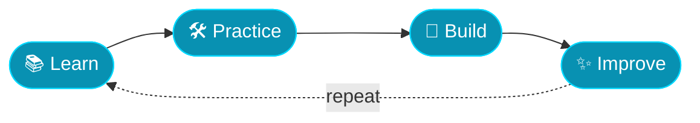

<!-- ═══════════════ HEADER ═══════════════ -->
<div align="center">


[](https://git.io/typing-svg)

<br/>


</div>

<br/>

<!-- ═══════════════ ABOUT ═══════════════ -->
## 👨‍💻 About Me

I'm a **Quality Engineering Intern at Deloitte** who loves the craft behind great software — how it's built, how it breaks, and how to make it reliably better.

I learn best by doing: shipping small projects, experimenting with new tech, and turning curiosity into working solutions. Right now my focus is on **test automation, Java, Playwright, web testing, and database testing**, with a growing interest in **AI-assisted development and product thinking**.



<br/>

<!-- ═══════════════ CURRENTLY ═══════════════ -->
## 💼 What I'm Up To

<table>
  <tr>
    <td width="50%" valign="top">

### 🏢 Quality Engineering @ Deloitte
Hands-on exposure to real-world testing and QE practices, including:

- 🧪 Software & functional testing
- 🤖 Test automation & frameworks
- 🎭 Playwright with Java
- 🌐 Web application testing
- 🗄️ Database testing

  </td>
    <td width="50%" valign="top">

### 🌱 Currently Exploring
- 🧩 Scalable automation framework design
- ✅ Regression & UI test strategy
- 🤖 AI-assisted development workflows
- 📱 Android & REST API integration
- 🎯 Product ideas & rapid prototyping

  </td>
  </tr>
</table>

<br/>

<!-- ═══════════════ TECH STACK ═══════════════ -->
## 🛠️ Tech Stack

<details open>
<summary><b>🧪 Testing & Automation</b></summary>
<br/>


`Functional Testing` · `Automation Testing` · `UI Testing` · `Regression Testing` · `Web App Testing` · `Database Testing` · `Test Case Design`

</details>

<details open>
<summary><b>💻 Development</b></summary>
<br/>


`Java` · `JavaScript` · `HTML5` · `CSS3` · `Android Development` · `REST API Integration` · `Responsive Web Design`

</details>

<details open>
<summary><b>🗄️ Database & Backend</b></summary>
<br/>


`REST APIs` · `Database Integration`

</details>

<details open>
<summary><b>🔧 Tools</b></summary>
<br/>


</details>

<details open>
<summary><b>🤖 AI & Product  ·  🎨 Design</b></summary>
<br/>


`AI-Assisted Development` · `AI Product Development` · `Prototyping` · `Product Management` · `UI/UX Design`

</details>

<br/>

<!-- ═══════════════ ACHIEVEMENTS ═══════════════ -->
## 🏆 Highlights

| | |
|---|---|
| 💼 **Quality Engineering Intern** | Deloitte |
| 🎖️ **State-Level Selection** | *Building with OpenAI* — NxtWave |
| 🚀 **Projects** | Built AI-powered and technology-driven projects |
| 📚 **Always learning** | Software testing, automation & development |

<br/>

<!-- ═══════════════ GITHUB STATS ═══════════════ -->
## 📈 GitHub Analytics

<div align="center">


</div>

<br/>

<!-- ═══════════════ DEVELOPER JOURNEY ═══════════════ -->
## 💻 Developer Journey

```java
public class Abhay {

    private final String role = "Quality Engineering Intern @ Deloitte";

    private final String[] stack = {
        "Java", "Playwright", "TestNG", "JavaScript",
        "HTML", "CSS", "Git", "GitHub"
    };

    private final String[] focus = {
        "Software Testing", "Test Automation", "Quality Engineering",
        "Web Testing", "Database Testing", "Web Development"
    };

    private final String[] interests = {
        "Automation", "Clean Code", "AI Products",
        "Technology", "Problem Solving"
    };

    public String goal() {
        return "Learn, build, test and improve";
    }

    public void dailyRoutine() {
        boolean curious = true;

        while (curious) {
            learn();
            code();
            test();
            automate();
            build();
            improve();
        }
    }
}
```

<br/>

<!-- ═══════════════ CONNECT ═══════════════ -->
## 🤝 Let's Connect

<div align="center">

[](https://github.com/ABHAY-0312)
<!-- Add your own links below, then remove the comment markers:
[](https://linkedin.com/in/YOUR-HANDLE)
[](mailto:YOUR-EMAIL)
-->

<br/>

> *"Quality is not an act, it is a habit."*

<br/>


</div>
